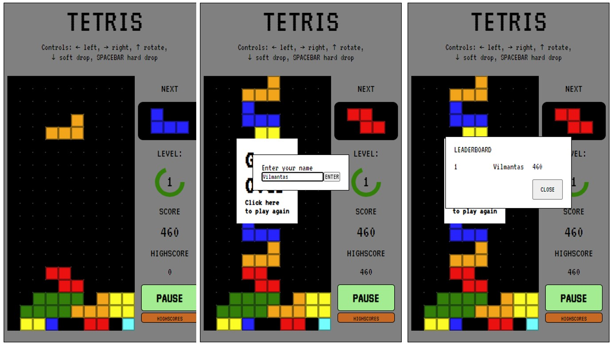

# Tetris

Classic Tetris game

## Table of contents

- [Overview](#overview)
  - [The features](#the-features)
  - [Screenshot](#screenshot)
  - [Links](#links)
- [My process](#my-process)
  - [Built with](#built-with)
- [Author](#author)

## Overview

### The features

- Basic Tetris game flow
- Soft-drop / hard-drop features
- Generating tetriminoes 2 "bags" in advance
- Leveling up by clearing lines
- Level progress indicator around level number
- Speed increase by leveling up
- Name input after gameover if score is within top 5
- Leaderboard of top5 scorers
- Leaderboard stored in local storage
- Preview of next tetrimino
- Countdown after start and resuming paused game
- Endless game after reaching level 10
- Scoring based on number of lines cleared at once

### Screenshot

### Links

- Solution URL: [Tetris](https://tetris.vilmantas.dev)

## My process

### Built with

- HTML
- HTML Canvas
- CSS
- JavaScript

## Author

- Github - [vilmis04](https://github.com/vilmis04)
- LinkedIn - [Vilmantas Sudaris](https://www.linkedin.com/in/vilmantas-sudaris-63567586)
